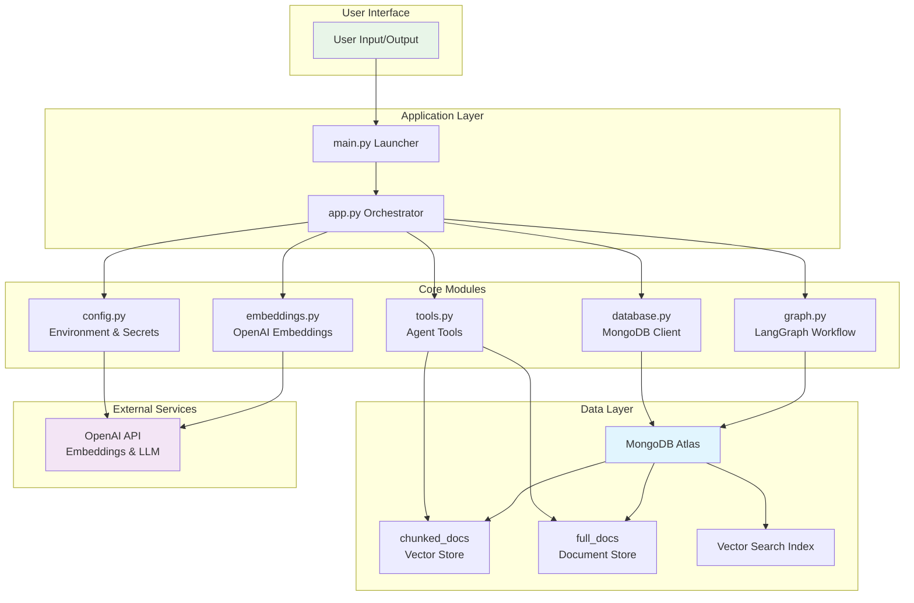
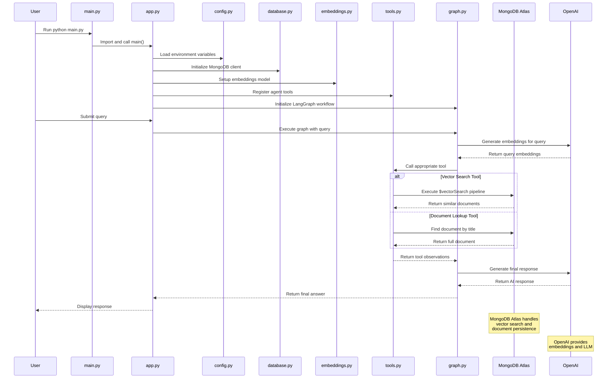
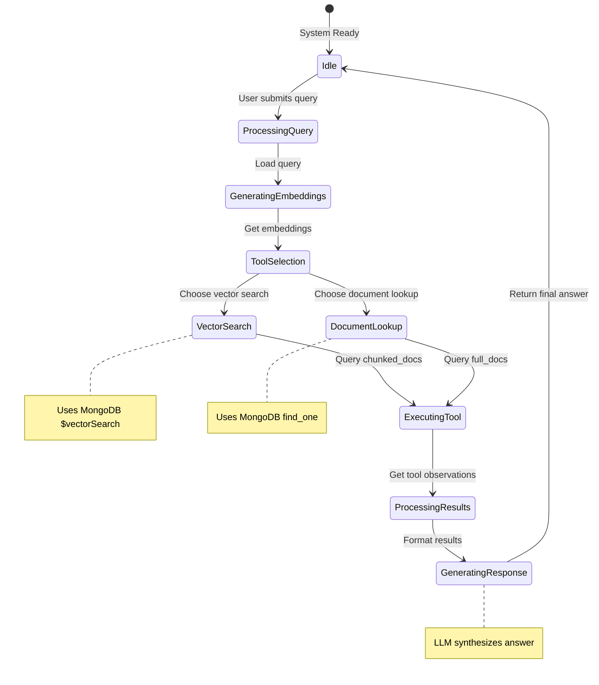

# mongo-rag-agent

This repository documents a production-grade AI agent built to validate knowledge in creating and deploying AI agents with MongoDB.
It demonstrates a multi-tool Retrieval-Augmented Generation (RAG) architecture that uses MongoDB Atlas for long-term storage, vector search, and tool-based reasoning.

## Why this project?

This digital credential confirms expertise in:
- Building a multi-tool AI agent using MongoDB as the core data platform.
- Designing agent decision-making that selects the best tool for each user query.
- Implementing long-term and short-term memory with MongoDB-backed persistence.
- Vectorizing document collections and embedding queries for semantic retrieval.

## Architecture Overview

1. **User Input**
   - A natural language query enters the system through the root launcher or package entrypoint.

2. **Agent Prompt & Tool Binding**
   - The agent prompt is constructed using `ChatPromptTemplate` and `MessagesPlaceholder`.
   - Two tools are bound to the LLM:
     - `get_information_for_question_answering`
     - `get_page_content_for_summarization`

3. **MongoDB Atlas Storage**
   - `chunked_docs` stores the vectorized document chunks and embeddings.
   - `full_docs` stores full documentation pages for direct summarization lookups.
   - MongoDB Atlas provides the vector search index and managed database service.

4. **Vector Search & Embeddings**
   - The system uses OpenAI embeddings to vectorize queries and document chunks.
   - The embeddings model is configured for MongoDB index compatibility.
   - Vector search is performed using MongoDB's `$vectorSearch` pipeline.

5. **Graph Workflow & Memory**
   - `langgraph` manages the agent workflow as a state graph.
   - The graph stores conversation state and tool call cycles.
   - `MongoDBSaver` persists graph checkpoints to MongoDB for short-term memory and recovery.

6. **Final Answer**
   - The agent receives tool observations and returns the final response to the user.

## Data Flow Architecture

```
─────────────────────────────────────────────────────────────────────────────────────┐
│                               USER INTERACTION                                     │
└─────────────────────────────────────────────────────────────────────────────────────┘

    User Query               main.py Launcher           Package Import
    (natural language)  ───────→  (sys.path setup)  ───────→  (mongo_rag_agent.app)
         │                           │                           │
         └───────────────────────────┴───────────────────────────┘
                                   │
                    ┌──────────────▼──────────────┐
                    │       app.py Orchestrator   │
                    │   - Load configuration      │
                    │   - Initialize MongoDB      │
                    │   - Setup embeddings        │
                    │   - Register tools          │
                    │   - Initialize graph        │
                    └──────────────┬──────────────┘
                                   │
┌──────────────────────────────────────────────────────────────────────────────────────┐
│                            AGENT & TOOL EXECUTION                                   │
└──────────────────────────────────────────────────────────────────────────────────────┘
                                   │
                   ┌───────────────▼────────────────┐
                   │   LangGraph Workflow           │
                   │   StateGraph + MongoDBSaver    │
                   │   Agent Node + Tool Node       │
                   └───────────────┬────────────────┘
                                   │
                   ┌───────────────▼────────────────┐
                   │   Tool Selection & Execution   │
                   │   - Vector Search Tool         │
                   │   - Document Lookup Tool       │
                   └───────────────┬────────────────┘
                                   │
┌──────────────────────────────────────────────────────────────────────────────────────┐
│                            MONGODB ATLAS OPERATIONS                                 │
└──────────────────────────────────────────────────────────────────────────────────────┘
                                   │
                   ┌───────────────▼────────────────┐
                   │   MongoDB Atlas                │
                   │   Database: ai_agents          │
                   │   Collections:                 │
                   │   - chunked_docs (vectors)     │
                   │   - full_docs (documents)      │
                   │   - Vector Search Index        │
                   └───────────────┬────────────────┘
                                   │
                   ┌───────────────▼────────────────┐
                   │   Query Processing             │
                   │   - $vectorSearch pipeline     │
                   │   - Document find_one          │
                   │   - Similarity scoring         │
                   └───────────────┬────────────────┘
                                   │
┌──────────────────────────────────────────────────────────────────────────────────────┐
│                              RESPONSE GENERATION                                    │
└──────────────────────────────────────────────────────────────────────────────────────┘
                                   │
                   ┌───────────────▼────────────────┐
                   │   OpenAI GPT-4o               │
                   │   Synthesize final answer     │
                   │   from tool observations      │
                   └───────────────┬────────────────┘
                                   │
    Final Response              Output Formatting         User Display
    (AI generated)  ───────→  (clean text)  ───────→  (terminal/console)
```

## System Flowchart

```mermaid
flowchart LR
    %% User Input Layer
    A([User Query]) --> B([main.py Launcher])
    B --> C([Add src/ to Python Path])
    C --> D([Import mongo_rag_agent.app])

    %% Application Layer
    D --> E([app.py: main()])
    E --> F([config.py: Load Environment])
    E --> G([database.py: Init MongoDB Client])

    %% Core Processing
    F --> H([embeddings.py: OpenAI Embeddings])
    G --> I([tools.py: Register Tools])
    I --> J([get_information_for_question_answering])
    I --> K([get_page_content_for_summarization])

    %% Data Layer
    J --> L([MongoDB Atlas: chunked_docs])
    K --> M([MongoDB Atlas: full_docs])

    %% Workflow Layer
    E --> N([graph.py: Init LangGraph])
    N --> O([StateGraph with MongoDBSaver])
    O --> P([Agent Node + Tool Node])

    %% Execution Layer
    E --> Q([execute_graph()])
    Q --> R([Stream Graph Execution])
    R --> S([Tool Calls → Observations])
    S --> T([Final Response])

    %% Data Processing
    L --> U([Vector Search Pipeline])
    M --> V([Document Lookup])
    U --> W([Similarity Scores])
    V --> X([Page Content])
    W --> S
    X --> S

    %% Output
    T --> Y([Output to User])

    %% Styling
    classDef userLayer fill:#e8f5e8,stroke:#2e7d32,stroke-width:2px
    classDef appLayer fill:#fff3e0,stroke:#ef6c00,stroke-width:2px
    classDef coreLayer fill:#e3f2fd,stroke:#1565c0,stroke-width:2px
    classDef dataLayer fill:#fce4ec,stroke:#ad1457,stroke-width:2px
    classDef workflowLayer fill:#f3e5f5,stroke:#6a1b9a,stroke-width:2px
    classDef execLayer fill:#e8f5e8,stroke:#2e7d32,stroke-width:2px

    class A,C,Y userLayer
    class B,D,E,F,G appLayer
    class H,I,J,K coreLayer
    class L,M,U,V,W,X dataLayer
    class N,O,P workflowLayer
    class Q,R,S,T execLayer
```


## Component Architecture



## Sequence Diagram



## State Diagram



## Project Structure

- `src/mongo_rag_agent/`
  - `app.py`: Application orchestration and graph execution.
  - `config.py`: Environment and secret management.
  - `database.py`: MongoDB client initialization and collection handling.
  - `embeddings.py`: OpenAI embedding generation and vector handling.
  - `tools.py`: Agent tools for vector search and page summarization.
  - `graph.py`: Graph state, tool routing, and checkpointing.
- `main.py`: Root launcher for direct local execution.
- `pyproject.toml`: Package metadata and install configuration.
- `requirements.txt`: Runtime and development dependencies.
- `tests/`: Basic package import and smoke tests.

## Setup

1. Clone the repository.
2. Create a `.env` file with:
   ```text
   MONGODB_URI=<your-mongodb-atlas-uri>
   OPENAI_API_KEY=<your-openai-api-key>
   ```
3. Install dependencies:
   ```bash
   python -m pip install -r requirements.txt
   ```
4. Run the launcher:
   ```bash
   python main.py
   ```

## Package Installation

Install in editable mode for development:

```bash
pip install -e .
```

Then run via package entrypoint:

```bash
mongo-rag-agent
```

## Production Considerations

- Use MongoDB Atlas for managed vector storage and database reliability.
- Keep environment variables in a secure vault or secrets store.
- Add logging and metrics around tool usage, vector search latency, and graph checkpoint writes.
- Enable `langgraph` checkpoint persistence for agent state recovery.
- Version the embedding schema and MongoDB vector index together.

## Additional Notes

- `main.py` is a lightweight launcher that loads the `src/` package.
- The architecture separates configuration, database access, embedding logic, tooling, and graph orchestration.
- This structure supports future extensions such as more tool connectors, dynamic tool selection, and advanced memory management.
