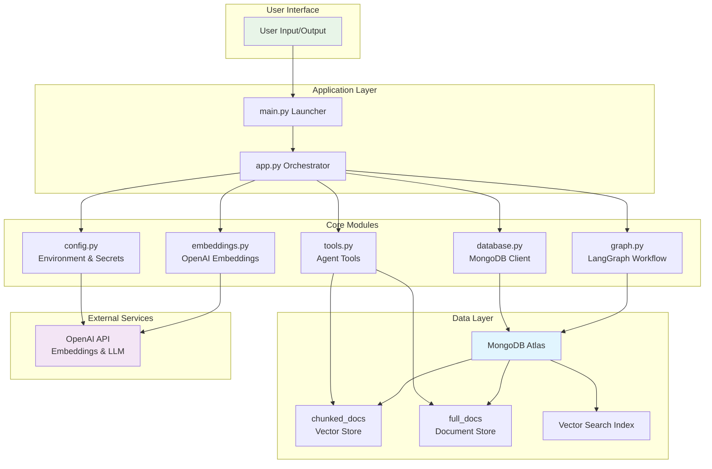
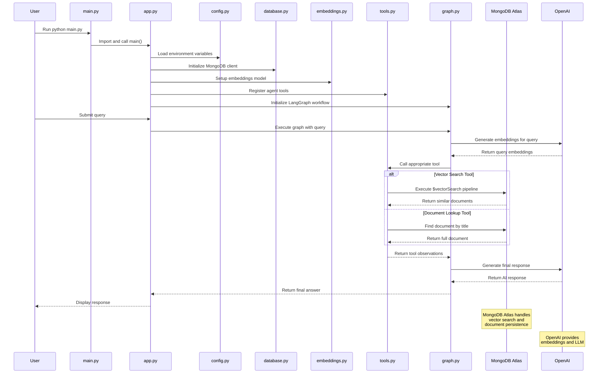
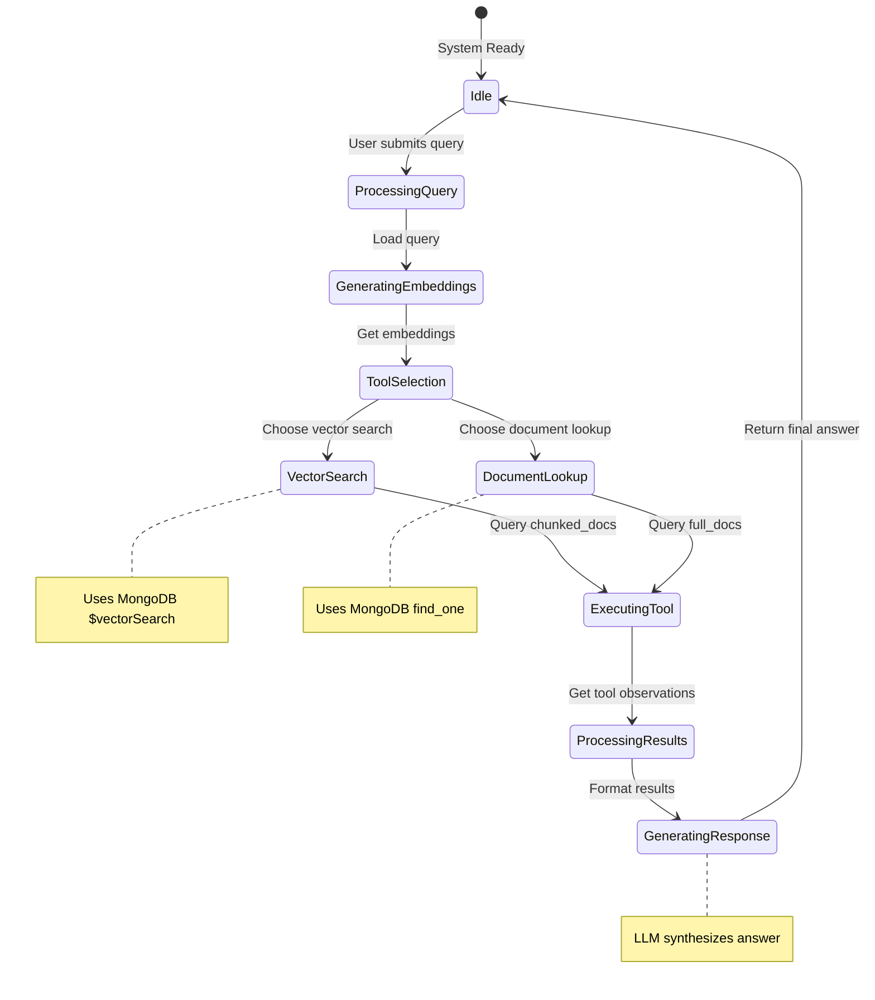

# MongoDB RAG Agent

A production-grade AI agent demonstrating multi-tool Retrieval-Augmented Generation (RAG) architecture using MongoDB Atlas for vector search and persistent memory.

## Quick Start

### Prerequisites
- Python 3.11+
- MongoDB Atlas account with vector search enabled
- OpenAI API key

### Installation

1. **Clone and setup environment:**
   ```bash
   git clone <repository-url>
   cd ai-agent-with-mongodb
   python -m venv .venv
   .venv\Scripts\activate  # Windows
   ```

2. **Configure environment variables:**
   Create a `.env` file:
   ```env
   MONGODB_URI=your-mongodb-atlas-connection-string
   OPENAI_API_KEY=your-openai-api-key
   ```

3. **Install dependencies:**
   ```bash
   pip install -r requirements.txt
   ```

4. **Run the agent:**
   ```bash
   python main.py
   ```

### Package Installation (Alternative)

For development or system-wide installation:
```bash
pip install -e .
mongo-rag-agent
```

## Architecture Overview

This agent implements a sophisticated RAG system with the following components:

### Core Components
- **Multi-Tool Agent**: Uses LangGraph for workflow orchestration with tool selection
- **Vector Search**: MongoDB Atlas vector search for semantic document retrieval
- **Memory Management**: Persistent conversation state using MongoDB checkpoints
- **Embedding Pipeline**: OpenAI embeddings optimized for MongoDB vector indexes

### Data Flow
1. User submits natural language query
2. Query is vectorized using OpenAI embeddings
3. Agent selects appropriate tool (vector search or document lookup)
4. MongoDB Atlas performs vector search or document retrieval
5. Results are synthesized by GPT-4o into final response
6. Conversation state is checkpointed to MongoDB

### Key Technologies
- **LangChain/LangGraph**: Agent orchestration and tool binding
- **MongoDB Atlas**: Vector database with managed search indexes
- **OpenAI**: Embeddings generation and response synthesis
- **Python 3.11+**: Modern async capabilities

## System Architecture Diagrams

### High-Level Data Flow

```
─────────────────────────────────────────────────────────────────────────────────────┐
│                               USER INTERACTION                                     │
└─────────────────────────────────────────────────────────────────────────────────────┘

    User Query               main.py Launcher           Package Import
    (natural language)  ───────→  (sys.path setup)  ───────→  (mongo_rag_agent.app)
         │                           │                           │
         └───────────────────────────┴───────────────────────────┘
                                   │
                    ┌──────────────▼──────────────┐
                    │       app.py Orchestrator   │
                    │   - Load configuration      │
                    │   - Initialize MongoDB      │
                    │   - Setup embeddings        │
                    │   - Register tools          │
                    │   - Initialize graph        │
                    └──────────────┬──────────────┘
                                   │
┌──────────────────────────────────────────────────────────────────────────────────────┐
│                            AGENT & TOOL EXECUTION                                   │
└──────────────────────────────────────────────────────────────────────────────────────┘
                                   │
                   ┌───────────────▼────────────────┐
                   │   LangGraph Workflow           │
                   │   StateGraph + MongoDBSaver    │
                   │   Agent Node + Tool Node       │
                   └───────────────┬────────────────┘
                                   │
                   ┌───────────────▼────────────────┐
                   │   Tool Selection & Execution   │
                   │   - Vector Search Tool         │
                   │   - Document Lookup Tool       │
                   └───────────────┬────────────────┘
                                   │
┌──────────────────────────────────────────────────────────────────────────────────────┐
│                            MONGODB ATLAS OPERATIONS                                 │
└──────────────────────────────────────────────────────────────────────────────────────┘
                                   │
                   ┌───────────────▼────────────────┐
                   │   MongoDB Atlas                │
                   │   Database: ai_agents          │
                   │   Collections:                 │
                   │   - chunked_docs (vectors)     │
                   │   - full_docs (documents)      │
                   │   - Vector Search Index        │
                   └───────────────┬────────────────┘
                                   │
                   ┌───────────────▼────────────────┐
                   │   Query Processing             │
                   │   - $vectorSearch pipeline     │
                   │   - Document find_one          │
                   │   - Similarity scoring         │
                   └───────────────┬────────────────┘
                                   │
┌──────────────────────────────────────────────────────────────────────────────────────┐
│                              RESPONSE GENERATION                                    │
└──────────────────────────────────────────────────────────────────────────────────────┘
                                   │
                   ┌───────────────▼────────────────┐
                   │   OpenAI GPT-4o               │
                   │   Synthesize final answer     │
                   │   from tool observations      │
                   └───────────────┬────────────────┘
                                   │
    Final Response              Output Formatting         User Display
    (AI generated)  ───────→  (clean text)  ───────→  (terminal/console)
```

### System Flowchart

```mermaid
flowchart LR
    %% User Input Layer
    A[User Query] --> B[main.py Launcher]
    B --> C[Add src/ to Python Path]
    C --> D[Import mongo_rag_agent.app]

    %% Application Layer
    D --> E[app.py: main()]
    E --> F[config.py: Load Environment]
    E --> G[database.py: Init MongoDB Client]

    %% Core Processing
    F --> H[embeddings.py: OpenAI Embeddings]
    G --> I[tools.py: Register Tools]
    I --> J[get_information_for_question_answering]
    I --> K[get_page_content_for_summarization]

    %% Data Layer
    J --> L[MongoDB Atlas: chunked_docs]
    K --> M[MongoDB Atlas: full_docs]

    %% Workflow Layer
    E --> N[graph.py: Init LangGraph]
    N --> O[StateGraph with MongoDBSaver]
    O --> P[Agent Node + Tool Node]

    %% Execution Layer
    E --> Q[execute_graph()]
    Q --> R[Stream Graph Execution]
    R --> S[Tool Calls → Observations]
    S --> T[Final Response]

    %% Data Processing
    L --> U[Vector Search Pipeline]
    M --> V[Document Lookup]
    U --> W[Similarity Scores]
    V --> X[Page Content]
    W --> S
    X --> S

    %% Output
    T --> Y[Output to User]

    %% Styling
    classDef userLayer fill:#e8f5e8,stroke:#2e7d32,stroke-width:2px
    classDef appLayer fill:#fff3e0,stroke:#ef6c00,stroke-width:2px
    classDef coreLayer fill:#e3f2fd,stroke:#1565c0,stroke-width:2px
    classDef dataLayer fill:#fce4ec,stroke:#ad1457,stroke-width:2px
    classDef workflowLayer fill:#f3e5f5,stroke:#6a1b9a,stroke-width:2px
    classDef execLayer fill:#e8f5e8,stroke:#2e7d32,stroke-width:2px

    class A,C,Y userLayer
    class B,D,E,F,G appLayer
    class H,I,J,K coreLayer
    class L,M,U,V,W,X dataLayer
    class N,O,P workflowLayer
    class Q,R,S,T execLayer
```

### Component Architecture



### Sequence Diagram



### State Diagram



## Project Structure

```
ai-agent-with-mongodb/
├── src/
│   └── mongo_rag_agent/
│       ├── __init__.py          # Package initialization
│       ├── app.py               # Main application orchestrator
│       ├── config.py            # Environment configuration
│       ├── database.py          # MongoDB client and collections
│       ├── embeddings.py        # OpenAI embedding generation
│       ├── tools.py             # Agent tools for RAG operations
│       └── graph.py             # LangGraph workflow definition
├── main.py                      # Root launcher script
├── pyproject.toml               # Package configuration
├── requirements.txt             # Python dependencies
├── README.md                    # This documentation
└── .env                         # Environment variables (create)
```

### Module Descriptions

- **`app.py`**: Central orchestrator that coordinates all components and executes the RAG workflow
- **`config.py`**: Manages environment variables and API keys securely
- **`database.py`**: Handles MongoDB Atlas connection and collection management
- **`embeddings.py`**: Generates vector embeddings using OpenAI API
- **`tools.py`**: Defines agent tools for vector search and document retrieval
- **`graph.py`**: Implements the LangGraph state machine with MongoDB persistence

## Configuration

### Environment Variables

| Variable | Description | Required |
|----------|-------------|----------|
| `MONGODB_URI` | MongoDB Atlas connection string | Yes |
| `OPENAI_API_KEY` | OpenAI API key for embeddings and LLM | Yes |

### MongoDB Setup

1. Create a MongoDB Atlas cluster
2. Enable vector search
3. Create database `ai_agents` with collections:
   - `chunked_docs`: Stores vectorized document chunks
   - `full_docs`: Stores complete documents
4. Create vector search index on `chunked_docs.embedding` field

## Production Deployment

### Security Considerations
- Store API keys in secure vaults (AWS Secrets Manager, Azure Key Vault, etc.)
- Use MongoDB Atlas IP whitelisting and authentication
- Implement rate limiting for API calls
- Add input validation and sanitization

### Performance Optimization
- Enable MongoDB query caching
- Use connection pooling for MongoDB client
- Implement embedding caching for repeated queries
- Add monitoring for vector search latency

### Monitoring & Observability
- Log tool usage and execution times
- Monitor MongoDB connection health
- Track vector search performance metrics
- Implement structured logging with correlation IDs

### Scaling Considerations
- Horizontal scaling with multiple MongoDB Atlas clusters
- Load balancing for embedding generation
- Caching layer for frequently accessed documents
- Async processing for long-running queries

## Development

### Running Tests
```bash
python -m pytest tests/
```

### Code Quality
```bash
# Linting
python -m flake8 src/

# Type checking
python -m mypy src/

# Formatting
python -m black src/
```

### Contributing
1. Fork the repository
2. Create a feature branch
3. Make changes with tests
4. Submit a pull request

## License

This project demonstrates AI agent development with MongoDB. See individual component licenses for usage terms.

## Additional Resources

- [MongoDB Atlas Vector Search Documentation](https://docs.mongodb.com/atlas/atlas-vector-search/)
- [LangGraph Documentation](https://langchain-ai.github.io/langgraph/)
- [OpenAI Embeddings Guide](https://platform.openai.com/docs/guides/embeddings)
